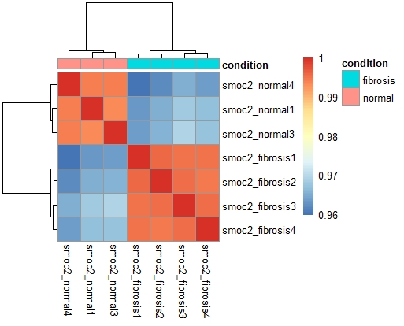
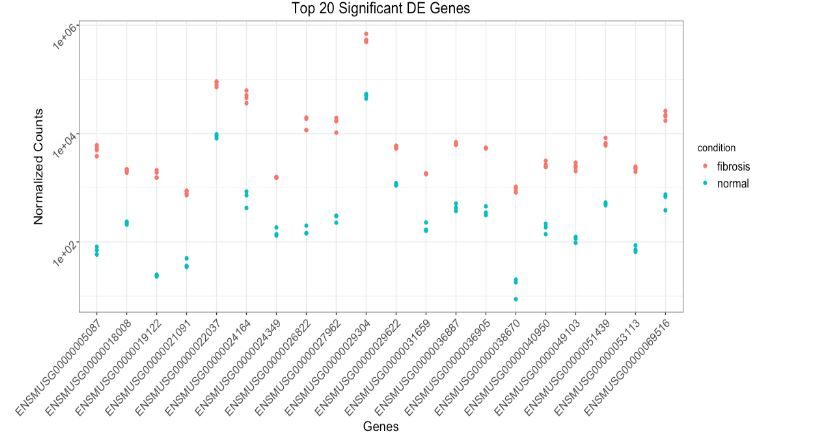

# Kidney-Fibrosis-RNA-Seq
Differential gene expression analysis is a technique to determine
whether the genes are express at significantly different levels 
between two or more sample groups.
I used Deseq2 pacakage to model the gene counts and identify 
differntially expressed genes. 
Therefor the goal of differntial expression analysis is to determine
for each gene whether the differnece in expression between
groups is significant, given that there some differences within the groups. 
We will be using publicly available RNA-seq dataset. 

The goal of the experiment was to determine whether the mice overexperssing SMOC2 gene. 
or producing more SMOC2 RNA than normal are more likely develop kidney fibrosis. 

There are 4 sample groups being tested. Normal control group with and without fibrosis.
And overexpressing smoc2 group with and without fibrosis. 

